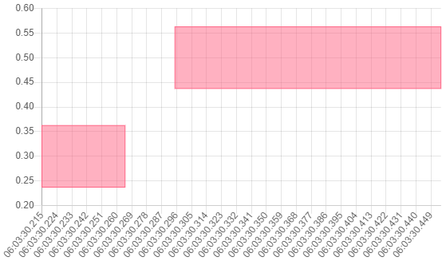
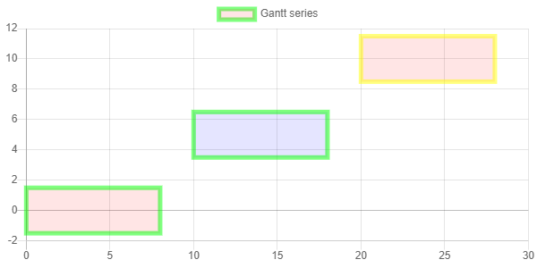
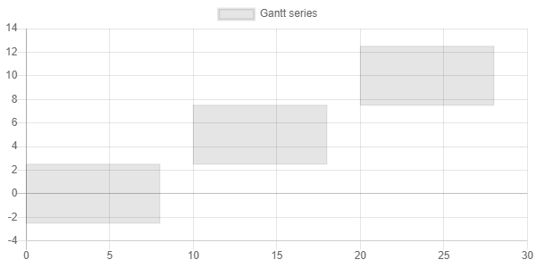
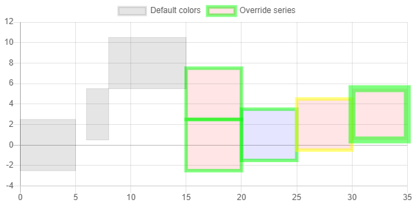
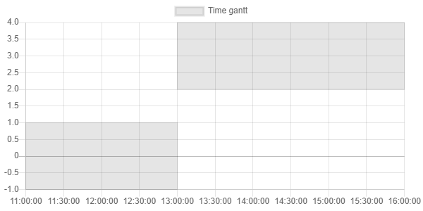

# [Gantt Chart](https://github.com/anton-shchyrov/chartjs-plugin-gantt.git) support for [ChartJs.Blazor](https://github.com/mariusmuntean/ChartJs.Blazor)
Integrating another chart type - what could possibly go wrong?

## Background
I'm using [Blazor](https://dotnet.microsoft.com/apps/aspnet/web-apps/blazor) in another project and needed to
show some time based data in a Gantt chart.  A quick web search showed a few commercial Blazor Gantt chart 
components, no free ones and a handful of open source, Javascript ones.  The most promising one was
[Gantt plugin](https://github.com/anton-shchyrov/chartjs-plugin-gantt.git), which is a plugin to draw gantt series 
in [Chart.js](https://www.chartjs.org/) library.

As I'm already using [Blazorise](https://github.com/Megabit/Blazorise), which already has a
[charts extension](https://github.com/Megabit/Blazorise/tree/master/Source/Extensions/Blazorise.Charts), how difficult
would it be to integrate another chart type?
The answer is quite [difficult](https://github.com/TrevorDArcyEvans/Blazorise_Charts_Gantt) :-(

After [that](https://github.com/TrevorDArcyEvans/Blazorise_Charts_Gantt) abortive effort, this integration actually works!

## Gant plugin overview

  
Gratuitous screenshots

### Sample chart

### Basic

### Different styles

### Different sizes

### Time scale

### Other

Gantt dataset supports two types of axes:
+ `linear-gantt` &mdash; the scale is inherited from the `linear` scale
+ `time-gantt` &mdash; the scale is inherited from the `time` scale

## Summary
* _ChartsJs.Blazorise_ code generally well written and easy to follow
* _chartjs-plugin-gantt_ code a bit obfuscated but probably due to my lack of Javascript
* integration relatively straightforward
* some changes required to _ChartsJs.Blazorise_ code
  * could implement as a plugin by unsealing various classes
* able to show a sample gantt chart
* .NET _DateTime_ structures have to be marshalled to Javascript as _double_ in order for
  _chartjs-plugin-gantt_ to recognise data as a Javascript _Date_
  * diagnosing this required debugging _chartjs-plugin-gantt_ Javascript code in the browser (!)
* _Chart.js_ has a huge number of options and it was unclear which applied to _chartjs-plugin-gantt_
  * various gantt chart options were blindly copied from bar chart, so a lot of options may not be applicable

