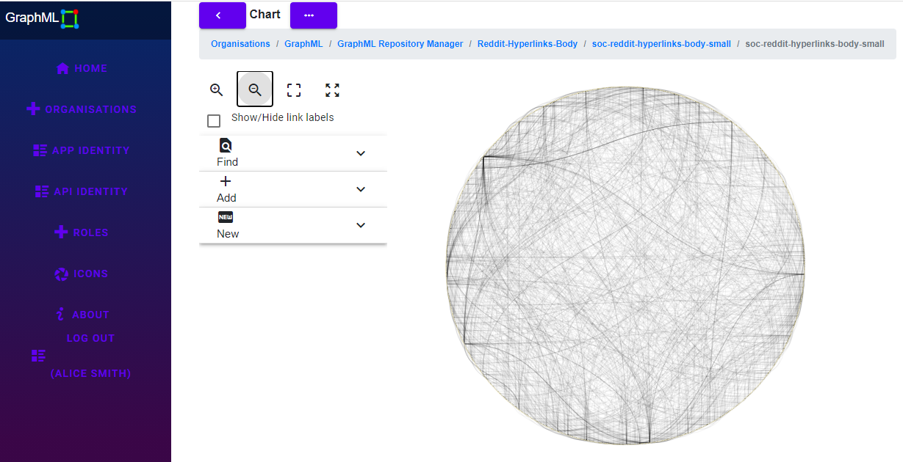

# GraphML 



GraphML analyses graphs for the following measures:

<details>
  <summary>ranked shortest paths</summary>

These calculations help your users understand ways to travel through (or ‘traverse’) a network.<p/>
The distance function measures how many hops apart two nodes are in a network. Shortest path 
highlights the route that passes through the lowest number of nodes. <p/>
Hops can also be weighted, meaning you can calculate actual distances, as well as the number of hops.<p/>

  [Wikipedia](https://en.wikipedia.org/wiki/K_shortest_path_routing)

</details>

<details>
  <summary>finding communities</summary>

Uses _Louvain_ method for finding communities in large networks as described in [Blondel et. al, 2008]. 
The main concept is that of network modularity that assesses the quality of the current community partition. 
The algorithm works by successively improving the network's modularity by trying to change the community that each node belongs to. 
If there is no improvement in modularity this means that the best community partition has been found.

[Wikipedia](http://en.wikipedia.org/wiki/Metaphone)

</details>

<details>
  <summary>finding duplicates</summary>

Uses _Double Metaphone_ phonetic encoding algorithm to find potentially duplicate entities.

[Wikipedia](https://en.wikipedia.org/wiki/Louvain_method)

</details>

**Social Network Analysis (SNA)**
  <details>
    <summary>closeness</summary>

This is the measure that helps you find the nodes that are closest to the other nodes in a network,
based on their ability to reach them.<p/>
To calculate this, the algorithm finds the shortest path between each node, then assigns each node a 
score based on the sum of all the paths.<p/>
Nodes with a high closeness value have a lower distance to all other nodes. They’d be efficient broadcasters of information.<p/> 

[Wikipedia](https://en.wikipedia.org/wiki/Centrality)

  </details>

  <details>
    <summary>betweeness</summary>

Nodes with a high betweenness centrality score are the ones that most frequently act as ‘bridges’ between other nodes. 
They form the shortest pathways of communication within the network.<p/>
Usually this would indicate important gatekeepers of information between groups.<p/>

[Wikipedia](https://en.wikipedia.org/wiki/Betweenness_centrality) <p/>

  </details>

  <details>
    <summary>degree</summary>
The degree centrality measure finds nodes with the highest number of links to other nodes in the network.<p/>
Nodes with a high degree centrality have the best connections to those around them – they might be influential,
or just strategically well-placed.<p/>

[Wikipedia]( https://en.wikipedia.org/wiki/Degree_(graph_theory) ) <p/>

  </details>

## Prerequisites

<details>
<p/>

* Mandatory:

  <details>

  * host:
    * Linux
    * Windows (not tested but should work)
  * target:
    * Linux (services)
    * Google Chrome web browser
  * .NET Core SDK v5.0
  * integrated development environment:
    * Visual Studio Code (Linux or Windows)
    * JetBrains Rider (Linux or Windows)
    * Visual Studio (Windows)
  * nodejs
  * git
  * Google Chrome web browser
    * primary web client
    * does not work with Apache ActiveMQ admin page
  * Firefox web browser
    * required to view Apache ActiveMQ admin page
  * database:
    * Microsoft SQL Server
    * MySQL or MariaDB
    * PostgreSQL
    * SQLite (local development only)
  * message queue:
    * [Apache ActiveMQ](http://activemq.apache.org/)
  * results store:
    * [Redis](https://redis.io/)

  </details>

* Optional

  <details>

  * [Git Extensions](https://github.com/gitextensions/gitextensions) (Windows)
  * [Docker](https://docs.docker.com/docker-for-windows/install/) (Windows)
  * [SwitchStartupProject for VS 2019](https://heptapod.host/thirteen/switchstartupproject/) (Visual Studio)
  * [npm](https://www.npmjs.com/get-npm)
  * [Redis Commander](https://www.npmjs.com/package/redis-commander)
  * [DBeaver](https://dbeaver.io/)
  * [DB Browser for SQLite](https://sqlitebrowser.org/)
  * [SQLiteStudio](https://sqlitestudio.pl/)
  * Microsoft SQL Server Management Studio (Windows)
  * [ReportGenerator](https://github.com/danielpalme/ReportGenerator)
  * [python](https://www.python.org/downloads/windows/)
  * [Doxygen](https://www.doxygen.nl/index.html)
  * [dot](https://graphviz.org/)

  </details>

</details>

## Getting Started

<details>
  <summary>Building</summary>
<p/>

1. clone repo
```bash
  git clone https://github.com/TrevorDArcyEvans/GraphML.git
```
1. build
```bash
  dotnet restore
  dotnet build
```
1. run tests
```bash
  dotnet test
```
1. run code coverage
```bash
  dotnet test /p:CollectCoverage=true /p:CoverletOutputFormat=opencover
```
1. generate code coverage report
``` bash
  reportgenerator -reports:**/coverage.opencover.xml -targetdir:./CodeCoverage
```
1. generate documentation
``` bash
  doxygen
```
open [documentation](file:///Documentation/html/index.html)

</details>

<details>
  <summary>Back End</summary>
<p/>

1. run _API_
```bash
  export ASPNETCORE_ENVIRONMENT=Development
  cd GraphML.API/bin/Debug/net5.0 
  ./GraphML.API
```
1. open [Swagger UI](https://localhost:5001/swagger/index.html)
1. start _Apache ActiveMQ_
1. start _Redis_
1. run _IdentityServer4_
```bash
  export ASPNETCORE_ENVIRONMENT=Development
  cd IdentityServerAspNetIdentity/bin/Debug/net5.0
  ./IdentityServerAspNetIdentity
```
1. open [IdentityServer4 Login](https://localhost:44387/Account/Login)
1. open [IdentityServer4 Discovery Document](https://localhost:44387/.well-known/openid-configuration)
1. run _Analysis Server_
```bash
  export ASPNETCORE_ENVIRONMENT=Development
  cd GraphML.API/bin/Debug/net5.0 
  ./GraphML.Analysis.Server
```
1. open [_Apache ActiveMQ_ management console](http://localhost:8161/admin)
1. start _Redis Commander_
```bash
  redis-commander --port 8080
```
1. open [_Redis Commander_ management console](http://127.0.0.1:8080)

</details>

<details>
  <summary>Front End/s</summary>

  **GraphML.UI.Web**
```bash
  export ASPNETCORE_ENVIRONMENT=Development
  cd GraphML.UI.Web/bin/Debug/net5.0
  ./GraphML.UI.Web
```
open https://localhost:5002/

</details>

<details>
  <summary>Docker</summary>

```bash
  docker-compose build
  docker-compose up
```
open https://localhost:5002/

</details>

## Environment Variables

<details>
  <summary>Backend API</summary>
<p/>

| Variable | Description | Example Value |
|----------|-------------|---------------|
| ASPNETCORE_ENVIRONMENT | ASP.NET Core runtime environment | `Production`, `Development`, `Test` |
||
| API_URI       | API server URL<p/>used by GraphML.API.Server to retrieve data |
||
| DATASTORE_CONNECTION         | | SqLite |
| DATASTORE_CONNECTION_TYPE    | | SqLite |
| DATASTORE_CONNECTION_STRING  | | Data Source=&#124;DataDirectory&#124;Data/GraphML.sqlite3;Foreign Keys=True; |
||
| LOG_CONNECTION_STRING | .NET connection string for database logging |
||
| RESULT_DATASTORE | _Redis_ URL | localhost:6379 |
||
| MESSAGE_QUEUE_URL               | _Apache ActiveMQ_ URL | activemq:tcp://localhost:61616 |
| MESSAGE_QUEUE_NAME              | | GraphML |
| MESSAGE_QUEUE_POLL_INTERVAL_S   | time in seconds between checking for new analysis jobs | 5 |
| MESSAGE_QUEUE_USE_THREADS       | | False |

</details>

## Overview

<details><p/>

  

</details>

## Architecture

<details><p/>
  <summary>Overview</summary>

  

</details>

## Analysis

<details><p/>
  <summary>Components</summary>

The following components are used to analyse a graph:
* [QuikGraph](https://github.com/KeRNeLith/QuikGraph)
  * betweeness
  * closeness
  * degree
* [Comuna](https://github.com/pedrodbs/Comuna)
  * finding communities
* [Phonix](https://github.com/eldersantos/phonix)
  * finding duplicates

</details>

<details><p/>
  <summary>Data flow</summary>

  

</details>

## Data Model

<details><p/>
  <summary>Classes</summary>


</details>

<details><p/>
  <summary>Composition</summary>


</details>

<details>
  <summary>Description</summary>

<details>
  <summary>Base</summary>
  Abstract entities which are ancestors for other GraphML entities.

  * Item
    * Ultimate ancestor of all GraphML objects.
    * Models something which can be persisted.
    * Every item ultimately belongs to an Organisation
  * OwnedItem
    * Something which has an immediate owner, other than an Organisation

</details>

<details>
  <summary>Containers</summary>
  Entities which serve as a holding place for other entities.
  
  * Organisation
    * Typically a company, organisation or other legal entity in which people work together.
      * police force
      * GCHQ
      * FBI
      * military
      * bank
    * Used to isolate information between different Organisations
    * Id and OrganisationId **must** be the same
  * RepositoryManager
    * A means to group a subset of Repository in an Organisation in some logical manner.
    * For example, repositories could be grouped at a departmental level eg 'Financial Fraud' or 'Credit Control'.
    * ItemAttributeDefinition are held at RepositoryManager level so they can be shared across Repository.
  * Repository
    * A complete collection of Node and Edge representing an area of interest.
  * Graph
    * A subset of Nodes and Edges from a Repository which have been extracted for separate analysis.
    * A Graph may be directed; in contrast to a Repository, which has no notion of direction.
  * Chart
    * A 2D pictorial representation of a subset of Nodes and Edges from a Graph.
    * Generally used to visualise analysis results.
    * Default implementation is a _Diagram_.
    * Layout algorithms can be applied to change the position of Nodes and Edges.
  * Timeline
    * A 2D pictorial representation of a subset of Nodes and Edges from a Graph.
    * Generally used to visualise temporal (time based) data.
    * Default implementation is a _gantt chart_.
    
</details>

<details>
  <summary>Graph</summary>

  * RepositoryItem
    * Something which is in a Repository, either a Node or an Edge
  * Node
    * A vertex representing something of interest.
    * A Node may be connected to zero or one other Nodes by an Edge
    * A Node may have properties associated with it via an NodeItemAttribute
  * Edge
    * A link connecting two Node.
    * An Edge may have a 'weight/s' (or other properties) associated with it via an EdgeItemAttribute
    * An Edge is not directed 'per se'; this is set on the Graph
    <p/>
  * GraphItem
    * Something which is in a Graph, either a GraphNode or a GraphEdge
  * GraphNode
    * A Node which appears in a Graph.
    * Name may be different to that of underlying Node
  * GraphEdge
    * An Edge which appears in a Graph.
    * Name may be different to that of underlying Edge
    <p/>
  * ChartItem
    * Something which is in a Chart, either a ChartNode or a ChartEdge
  * ChartNode
    * A Node which appears in a Chart.
    * Name may be different to that of underlying Node
  * ChartEdge
    * An Edge which appears in a Chart.
    * Name may be different to that of underlying Edge

</details>

<details>
  <summary>Attributes</summary>
  ItemAttributeDefinition are held at RepositoryManager level so they can be shared across Repository.

  * ItemAttributeDefinition
    * Defines shape (name and data type) of information in an ItemAttribute
  * RepositoryItemAttributeDefinition
    * Defines shape of information in a RepositoryItemAttribute
  * GraphItemAttributeDefinition
    * Defines shape of information in a GraphItemAttribute
  * NodeItemAttributeDefinition
    * Defines shape of information in a NodeItemAttribute
  * EdgeItemAttributeDefinition
    * Defines shape of information in an EdgeItemAttribute
    <p/>
  * ItemAttribute
    * Additional information attached to an Item
  * RepositoryItemAttribute
    * Additional information attached to a Repository
  * GraphItemAttribute
    * Additional information attached to a Graph
  * NodeItemAttribute
    * Additional information attached to a Node
  * EdgeItemAttribute
    * Additional information attached to an Edge
    <p/>
  * Currently supported data types:
    * string
    * bool
    * int
    * double
    * DateTime (UTC)
    * DateInterval (UTC)

</details>

<details>
  <summary>Support</summary>

  * Contact
    * A person identified by their email address.
    * The email address (Name) is used to link authentication (IdentityServer4) to Role.
  * Role
    * The function performed by a Contact in the context of GraphML.
    * There are several, predefined functions in Roles
    * A Contact may have one or more Roles
  * Roles
    * User roles within GraphML

</details>

</details>

## Authentication & Authorisation

<details>
  <summary>Roles and Users</summary>

* enable `Development` mode by setting env var:  
```bash
  export ASPNETCORE_ENVIRONMENT=Development
```
* authentication (who you are) is handled by IdentityServer
* authorisation (what you can do) is handled by GraphML, based on an _email_ claim
* security is role based, with the following predefined roles:

| Role        | Description |
|-------------|-------------|
| User        | An entity using GraphML |
| UserAdmin   | An entity managing a subset of data within GraphML, typically data belonging to a single organisation |
| Admin       | An entity managing all data within GraphML |
* the above roles are owned by _System_ organisation
* SwaggerUI is only enabled in `Development` mode
* SwaggerUI authentication will redirect to a login screen in IdentityServer
* GraphML and IdentityServer4 have some test users:

| UserName | Password     | Email                           | Roles | Notes |
|----------|--------------|---------------------------------|-------|-------|
| `alice`  | `Pass123$`   | DrKool@KoolOrganisation.org     | Admin | system wide admin |
| `bob`    | `Pass123$`   | BobSmith@email.com              | none | known to _IdentityServer4_ but not _GraphML_ |
| `carol`  | `Pass123$`   | carol@KoolOrganisation.org      | UserAdmin |
| `dave`   | `Pass123$`   | dave@KoolOrganisation.org       | User |
| `eric`   | `Pass123$`   | eric@GraphML.com                | User |

</details>

<details>
  <summary>How to add a new user</summary>

* add user to _GraphML_
  * `GraphML:./GraphML.Datastore.Database/Data/Import.sql`
  * import into database
* add user to _IdentityServer4_
  * `GraphML:./IdentityServerAspNetIdentity/SeedData.cs`
  * import into database
    ```bash
    ./IdentityServerAspNetIdentity.exe /seed
    ```

</details>

</details>

## User Interface

<details>

A reference browser based GUI is provided.  This is written in [Blazor](https://en.wikipedia.org/wiki/Blazor)
and uses the following components:
* [Blazor.ContextMenu](https://github.com/stavroskasidis/BlazorContextMenu)
* [Blazorise](https://blazorise.com/)
* [Blazorise.Bootstrap](https://blazorise.com/docs/usage/bootstrap/)
* [Blazorise.Icons.FontAwesome](https://blazorise.com/docs/extensions/icons/)
* [BlazorPro.Spinkit](https://github.com/EdCharbeneau/BlazorPro.Spinkit)
* [BlazorRazor](https://github.com/Tricklebyte/BlazorRazor)
* [BlazorTable](https://github.com/IvanJosipovic/BlazorTable)
* [GraphShape](https://github.com/KeRNeLith/GraphShape) (graph layout)
* [MatBlazor](https://www.matblazor.com/)
* [Z.Blazor.Diagrams](https://github.com/Blazor-Diagrams/Blazor.Diagrams) (graph visualisation)
* [ChartJs.Blazor](https://github.com/mariusmuntean/ChartJs.Blazor) (timeline visualisation)

At this stage, printing is limited to using the web browser's native printing.
Export to PDF (or other formats) is not supported by the current diagramming 
component (Z.Blazor.Diagrams) but may be possible with other components
eg [Syncfusion](https://www.syncfusion.com/blazor-components/blazor-diagram) or
[Blazor.Diagrams](https://github.com/excubo-ag/Blazor.Diagrams).
Obviously, replacing such a fundamental component is risky and difficult.

Icons should be 32x32 pixels in size and are resized to this for display.

There are *many* sources of free or low cost icons on the internet eg:
* [flaticon](https://www.flaticon.com/)
* [Aroma-Free-Icon-Set-For-Designers](https://www.smashingmagazine.com/2011/11/free-icon-set-for-web-designers-aroma-250-png-icons/)
* [Basal Icons](https://webneel.com/post/freedownload/web-design/icon-design/basal-icons)
* [Iconshock](https://www.iconshock.com/)
* [Iconshock-Windows-7](https://www.iconshock.com/windows-icons/)
* [Onebit](https://iconarchive.com/show/onebit-icons-by-icojam.html)
* [Ultimate-Free-Web-Designer-Icon-Set](https://www.webfx.com/blog/web-design/free-icons-1000/)
* [WooFunction Icons](https://iconarchive.com/show/woofunction-icons-by-wefunction.html)

</details>

## Multi-Tenancy

<details>

At this stage, multi-tenancy isolation is implemented in GraphML.Logic:
* GraphML.Logic.Validators
  * does the initial call even make sense
  * only allow calls on items which caller is allowed to access
* GraphML.Logic.Filters
  * only return items relevant to the caller
  * only return items caller is allowed to see

Future work will change to a database-per-client type of isolation
which is better suited to high security environments.
This will make validators and filters redundnant as all calls are
guaranteed to come from the same organisation.  In turn, this will
make the Organisation entity redundant.

Alternatively, a dedicated deployment *per organisation* would achieve
a similar effect at the expense of managing each deployment.

</details>

## Third Party Bugs

### Z.Blazor.Diagrams

<details>

* [How to reattach links](https://github.com/Blazor-Diagrams/Blazor.Diagrams/issues/91)
* ~~[Deleting link on portless node leaves dangling link - inconsistent with ported node](https://github.com/Blazor-Diagrams/Blazor.Diagrams/issues/96)~~
* [No way to interactively create links between portless nodes](https://github.com/Blazor-Diagrams/Blazor.Diagrams/issues/99)
* [Enhancement request: separate links between same pairs of nodes](https://github.com/Blazor-Diagrams/Blazor.Diagrams/issues/100)
* ~~[Enhancement request: Would like Diagram.MouseDoubleClick event](https://github.com/Blazor-Diagrams/Blazor.Diagrams/issues/101)~~
* ~~[Moving ported nodes programmatically results in links rendered incorrectl](https://github.com/Blazor-Diagrams/Blazor.Diagrams/issues/102)~~
* [Enhancement request: Export to PDF](https://github.com/Blazor-Diagrams/Blazor.Diagrams/issues/103)
* [NavigatorWidget not work with empty Diagram](https://github.com/Blazor-Diagrams/Blazor.Diagrams/issues/104)

</details>

### MatBlazor

<details>

* [HideClearButton has no effect on MatTextField](https://github.com/SamProf/MatBlazor/issues/718)
* [Support all Material Icons](https://github.com/SamProf/MatBlazor/issues/868)
* [Ability to use own icon packs](https://github.com/SamProf/MatBlazor/issues/732)

</details>

## Misc

<details>
  <summary>Port Allocations</summary>

| Service | Port | Notes |
|---------|------|-------|
| IdentityServerAspnetIdentity | 44387 |
| GraphML.API | 5001 |
| GraphML.UI.Web | 5002 |
| Apache ActiveMQ | 61616 |
| Apache ActiveMQ console | 8161 |
| Redis | 6379 |
| Redis Commander | 8080 | default port 8081
| Microsoft SQL Server | 1443 |
| MariaDB | 3306 |
| PostgreSQL | 5432 |

</details>

<details>
  <summary>Apache ActiveMQ</summary>

You can monitor ActiveMQ using the Web Console by pointing your browser at http://localhost:8161/admin .  
From ActiveMQ 5.8 onwards the web apps is secured out of the box.  
The default username and password is `admin/admin`.

There seems to be a problem accessing the Web Console from Google Chrome, so it
is recommended to use Firefox (or Microsoft Edge).

</details>

<details>
  <summary>Redis</summary>

### Redis on Windows
Recommended method is to use a _Docker_ container:
```bash
  docker pull redis
  docker run -p 6379:6379 redis
```

Alternate method is to install and run Redis on WSL:

  https://redislabs.com/blog/redis-on-windows-10/

```bash
  sudo apt install redis-server
  sudo service redis-server status
  sudo service redis-server start
  sudo service redis-server stop
```

### Redis Commander
```bash
  npm install -g redis-commander
  redis-commander --port 8080
```
open [_Redis Commander_ management console](http://127.0.0.1:8080)

_**Pro Tip**_ : to reset the database, use `flushdb`

### Markdown Viewer
This document is best view in Google Chrome with the [Markdown Viewer extension](https://chrome.google.com/webstore/detail/markdown-viewer/ckkdlimhmcjmikdlpkmbgfkaikojcbjk).
Remember to enable access to file urls in the settings.

</details>

## Further Work

<details>

* update _ranked shortest path_ to support temporal analysis
  * going forward in time eg for financial transactions or phone calls
  * support `DateTimeInterval`
  * should be able to transform graph such that links which go backwards in time have infinite weight
  * provide UI to select time attribute
* *really* improve timeline visualisation
  * probably best to invest in _Syncfusion_ diagramming component (!)
* improve printing/export
  * probably best to invest in _Syncfusion_ diagramming component (!)
* support AMQP
* support other datastores
* unit tests

</details>
