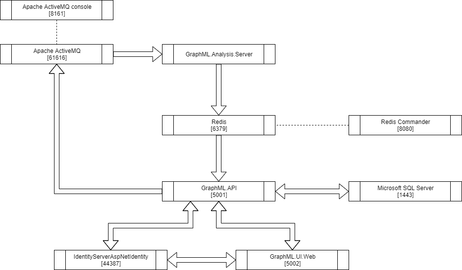
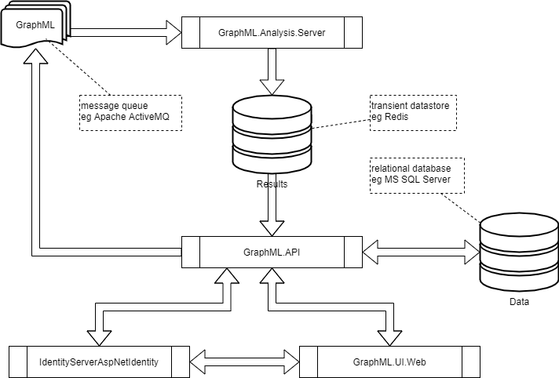
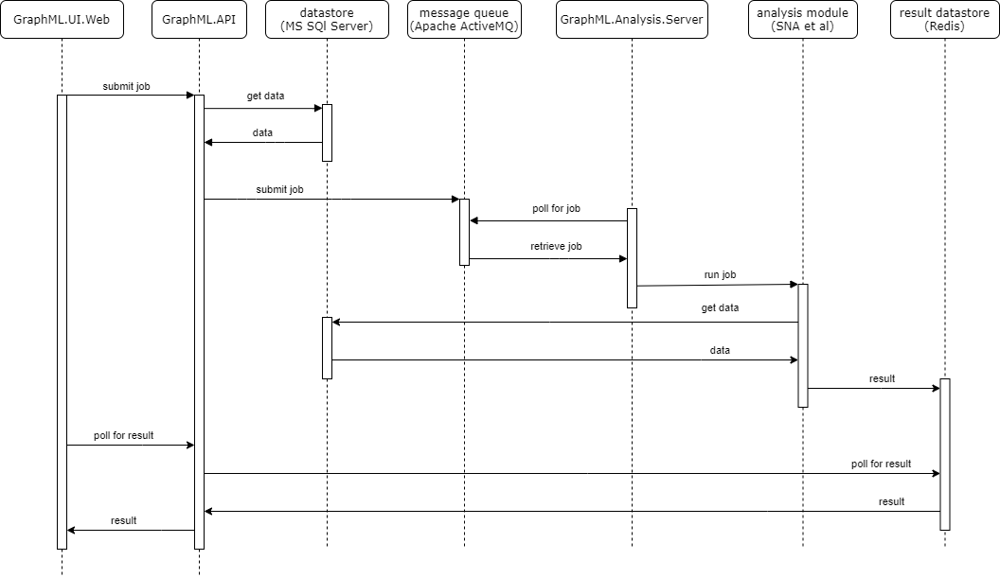
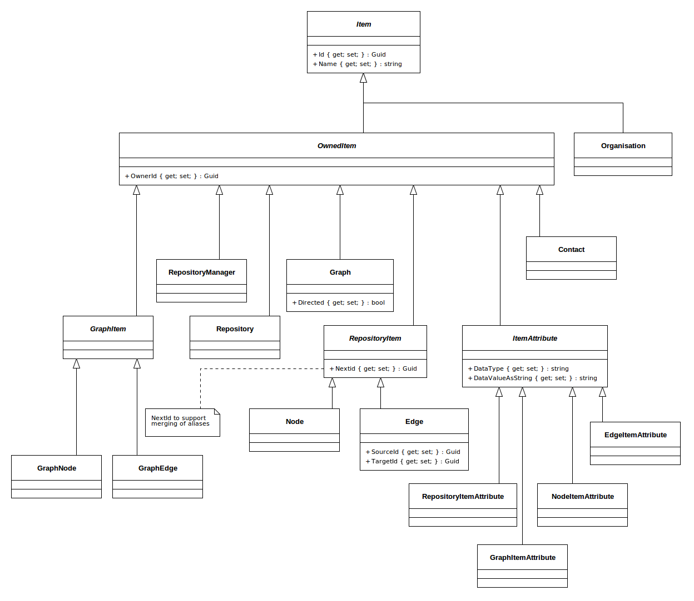
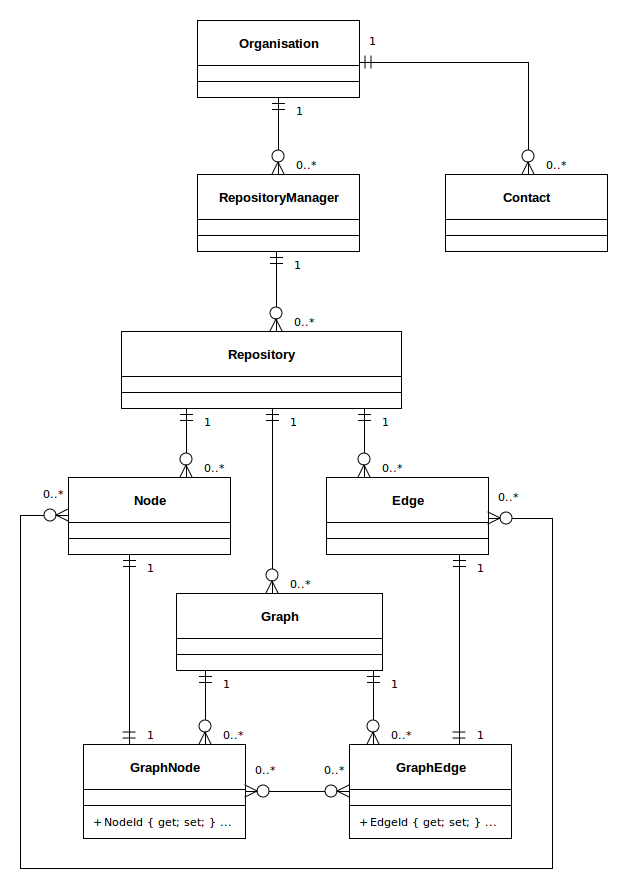

# GraphML 
GraphML analyses graphs for the following measures:

* ranked shortest paths
  <details>
These calculations help your users understand ways to travel through (or ‘traverse’) a network.<p/>
The distance function measures how many hops apart two nodes are in a network. Shortest path highlights the route that passes through the lowest number of nodes. 
Hops can also be weighted, meaning you can calculate actual distances, as well as the number of hops.
  </details>
* Social Network Analysis (SNA)
  * closeness
    <details>
This is the measure that helps you find the nodes that are closest to the other nodes in a network, based on their ability to reach them.<p/>
To calculate this, the algorithm finds the shortest path between each node, then assigns each node a score based on the sum of all the paths.<p/>
Nodes with a high closeness value have a lower distance to all other nodes. They’d be efficient broadcasters of information.
    </details>
  * betweeness
    <details>
Nodes with a high betweenness centrality score are the ones that most frequently act as ‘bridges’ between other nodes. 
They form the shortest pathways of communication within the network.<p/>
Usually this would indicate important gatekeepers of information between groups.
    </details>
  * degree
    <details>
The degree centrality measure finds nodes with the highest number of links to other nodes in the network.<p/>
Nodes with a high degree centrality have the best connections to those around them – they might be influential, or just strategically well-placed.
    </details>

## Prerequisites
<details>

1. Prerequisites:
  * host:
    * Linux
    * Windows (not tested but should work)
  * target:
    * Linux
  * .NET Core SDK v3.1
  * git
  * integrated development environment:
    * Visual Studio Code (Linux or Windows)
    * JetBrains Rider (Linux or Windows)
    * Visual Studio (Windows)
  * database:
    * Microsoft SQL Server
    * MySQL or MariaDB
    * PostgreSQL
    * SQLite (local development only)
  * message queue:
    * [Apache ActiveMQ](http://activemq.apache.org/)
  * results store:
    * [Redis](https://redis.io/)
1. Optional
  * [Git Extensions](https://github.com/gitextensions/gitextensions) (Windows)
  * [Docker](https://docs.docker.com/docker-for-windows/install/) (Windows)
  * [SwitchStartupProject for VS 2019](https://heptapod.host/thirteen/switchstartupproject/) (Visual Studio)
  * [npm](https://www.npmjs.com/get-npm)
  * [Redis Commander](https://www.npmjs.com/package/redis-commander)
  * [DBeaver](https://dbeaver.io/)
  * [DB Browser for SQLite](https://sqlitebrowser.org/)
  * [SQLiteStudio](https://sqlitestudio.pl/)
  * Microsoft SQl Server Management Studio (Windows)

</details>

## Getting Started
<details>

1. clone repo
```bash
  git clone https://github.com/TrevorDArcyEvans/GraphML.git
```
1. build
```bash
  dotnet restore
  dotnet build
```
1. run tests
```bash
  dotnet test
```
1. run API
```bash
  export ASPNETCORE_ENVIRONMENT=Development
  cd GraphML.API/bin/Debug/netcoreapp3.1 
  ./GraphML.API
```
1. open [Swagger UI](http://localhost:5000/swagger/index.html)
1. start _Apache ActiveMQ_
1. start _Redis_
1. run analysis server
```bash
  export ASPNETCORE_ENVIRONMENT=Development
  cd GraphML.API/bin/Debug/netcoreapp3.1 
  ./GraphML.Analysis.Server
```
1. open [_Apache ActiveMQ_ management console](http://localhost:8161/admin)
1. start _Redis Commander_
```bash
  redis-commander --port 8080
```
1. open [_Redis Commander_ management console](http://127.0.0.1:8080)

</details>

## Environment Variables
<details>

### Backend API
<details>

|Variable | Description | Example Value|
|---------|-------|--------------|
ASPNETCORE_ENVIRONMENT | ASP.NET Core runtime environment | `Production`, `Development`, `Test`
||
API_URI       | |
API_USERNAME  | |
API_PASSWORD  | |
||
DATASTORE_CONNECTION         | | SqLite
DATASTORE_CONNECTION_TYPE    | | SqLite
DATASTORE_CONNECTION_STRING  | | Data Source=&#124;DataDirectory&#124;Data/GraphML.sqlite3; |
||
LOG_CONNECTION_STRING | |
LOG_BEARER_AUTH       | | False
||
RESULT_DATASTORE | | localhost:6379
||
KESTREL_URL                  | | http://localhost:5000
||
MESSAGE_QUEUE_URL               | | activemq:tcp://localhost:61616
MESSAGE_QUEUE_NAME              | | GraphML
MESSAGE_QUEUE_POLL_INTERVAL_S   | | 5
MESSAGE_QUEUE_USE_THREADS       | | False

</details>
</details>

## Overview
<details><p/>

  

</details>

## Architecture
<details><p/>

  

</details>

## Analysis
<details><p/>

  

</details>

## Data Model
<details>
  <summary>Classes</summary>



</details>

<details>
  <summary>Composition</summary>



</details>

## Notes
<details>

* enable `Development` mode by setting env var:  
```bash
  export ASPNETCORE_ENVIRONMENT=Development
```
* SwaggerUI is only enabled in `Development` mode
* Basic authentication (username/password) is only enabled in `Development` mode
* Basic authentication is `username`=`password` eg `Admin/Admin`
* For basic authentication, `role`=`username`

</details>

## Misc
<details>

### Port Allocations
| Service | Port | Notes |
|---------|------|-------|
| IdentityServerAspnetIdentity | 44387 |
| GraphML.API | 5001 |
| GraphML.UI.Web | 5002 |
| Apache ActiveMQ | 61616 |
| Apache ActiveMQ console | 8161 |
| Redis | 6379 |
| Redis Commander | 8080 | default port 8081
| Microsoft SQL Server | 1443 |
| MariaDB | 3306 |
| PostgreSQL | 5432 |

### Apache ActiveMQ
You can monitor ActiveMQ using the Web Console by pointing your browser at http://localhost:8161/admin .  
From ActiveMQ 5.8 onwards the web apps is secured out of the box.  
The default username and password is `admin/admin`.

### Redis on Windows
Recommended method is to use a _Docker_ container:
```bash
  docker pull redis
  docker run -p 6379:6379 redis
```

### Redis Commander
```bash
  npm install -g redis-commander
  redis-commander --port 8080
```
open [_Redis Commander_ management console](http://127.0.0.1:8080)

</details>
