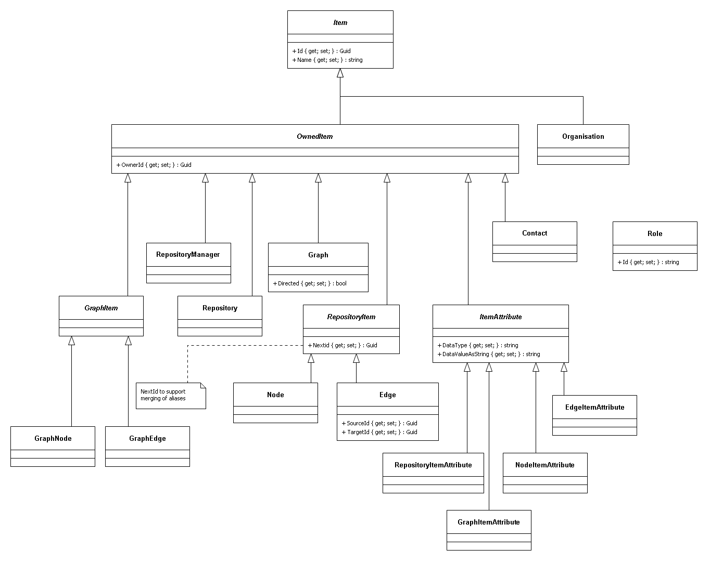
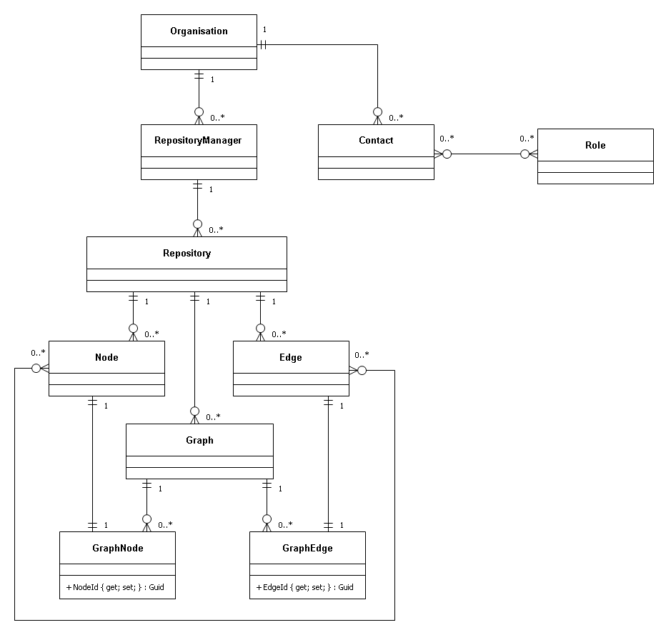

# GraphML
GraphML analyses graphs for the following measures:

* ranked shortest paths
* Social Network Analysis (SNA)
  * closeness
  * betweeness
  * degree

## Prerequisites
<details>
  
1. Prerequisites:
  * host:
    * Linux
    * Windows (not tested but should work)
  * target:
    * Linux
  * .NET Core SDK v3.1
  * git
  * integrated development environment:
    * Visual Studio Code (Linux or Windows)
    * JetBrains Rider (Linux or Windows)
    * Visual Studio (Windows)
  * database:
    * Microsoft SQL Server
    * MySQL or MariaDB
    * PostgreSQL
    * SQLite (local development only)
  * message queue:
    * [Apache ActiveMQ](http://activemq.apache.org/)
  * results store:
    * [Redis](https://redis.io/)
1. Optional
  * [Git Extensions](https://github.com/gitextensions/gitextensions) (Windows)
  * [Docker](https://docs.docker.com/docker-for-windows/install/) (Windows)
  * [SwitchStartupProject for VS 2019](https://heptapod.host/thirteen/switchstartupproject/) (Visual Studio)
  * [npm](https://www.npmjs.com/get-npm)
  * [Redis Commander](https://www.npmjs.com/package/redis-commander)
  * [SQLiteStudio](https://sqlitestudio.pl/)
  * Microsoft SQl Server Management Studio (Windows)

</details>

## Getting Started
<details>

1. clone repo
```bash
  git clone https://github.com/TrevorDArcyEvans/GraphML.git
```
1. build
```bash
  dotnet restore
  dotnet build
```
1. run tests
```bash
  dotnet test
```
1. run API
```bash
  export ASPNETCORE_ENVIRONMENT=Development
  cd GraphML.API/bin/Debug/netcoreapp3.1 
  ./GraphML.API
```
1. open [Swagger UI](http://localhost:5000/swagger/index.html)
1. start _Apache ActiveMQ_
1. start _Redis_
1. run analysis server
```bash
  export ASPNETCORE_ENVIRONMENT=Development
  cd GraphML.API/bin/Debug/netcoreapp3.1 
  ./GraphML.Analysis.Server
```
1. open [_Apache ActiveMQ_ management console](http://localhost:8161/admin)
1. start _Redis Commander_
```bash
  redis-commander --port 8080
```
1. open [_Redis Commander_ management console](http://127.0.0.1:8080)

</details>

## Environment Variables
<details>

### Backend API
<details>

|Variable | Description | Example Value|
|---------|-------|--------------|
ASPNETCORE_ENVIRONMENT | ASP.NET Core runtime environment | `Production`, `Development`, `Test`
||
API_URI       | |
API_USERNAME  | |
API_PASSWORD  | |
||
DATASTORE_CONNECTION         | | SqLite
DATASTORE_CONNECTION_TYPE    | | SqLite
DATASTORE_CONNECTION_STRING  | | Data Source=&#124;DataDirectory&#124;Data/GraphML.sqlite3; |
||
LOG_CONNECTION_STRING | |
LOG_BEARER_AUTH       | | False
||
OIDC_USERINFO_URL | |
OIDC_ISSUER_URL   | |
OIDC_AUDIENCE     | |
||
RESULT_DATASTORE | | localhost:6379
||
KESTREL_URLS                  | | http://localhost:5000
||
MESSAGE_QUEUE_URL               | | activemq:tcp://localhost:61616
MESSAGE_QUEUE_NAME              | | GraphML
MESSAGE_QUEUE_POLL_INTERVAL_S   | | 5
MESSAGE_QUEUE_USE_THREADS       | | False

</details>
</details>

## Architecture
<details>

  

</details>

## Analysis
<details>

  

</details>

## Data Model
<details>

  <details>
    <summary>Classes</summary>

  

  </details>
  
  <details>
    <summary>Composition</summary>

  

  </details>

</details>

## Notes
<details>

* enable `Development` mode by setting env var:  
```bash
  export ASPNETCORE_ENVIRONMENT=Development
```
* SwaggerUI is only enabled in `Development` mode
* Basic authentication (username/password) is only enabled in `Development` mode
* Basic authentication is `username`=`password` eg `Admin/Admin`
* For basic authentication, `role`=`username`

</details>

## Misc
<details>

### Port Allocations
| Service | Port | Notes |
|---------|------|-------|
| GraphML.UI.Web | 5001 |
| GraphML.API | 5000 |
| Apache ActiveMQ | 61616 |
| Apache ActiveMQ console | 8161 |
| Redis | 6379 |
| Redis Commander | 8080 | default port 8081
| Microsoft SQL Server | 1443 |
| MariaDB | 3306 |
| PostgreSQL | 5432 |

### Apache ActiveMQ
You can monitor ActiveMQ using the Web Console by pointing your browser at http://localhost:8161/admin .  
From ActiveMQ 5.8 onwards the web apps is secured out of the box.  
The default username and password is `admin/admin`.

### Redis on Windows
Recommended method is to use a _Docker_ container:
```bash
  docker pull redis
  docker run -p 6379:6379 redis
```

### Redis Commander
```bash
  npm install -g redis-commander
  redis-commander --port 8080
```
open [_Redis Commander_ management console](http://127.0.0.1:8080)

</details>
