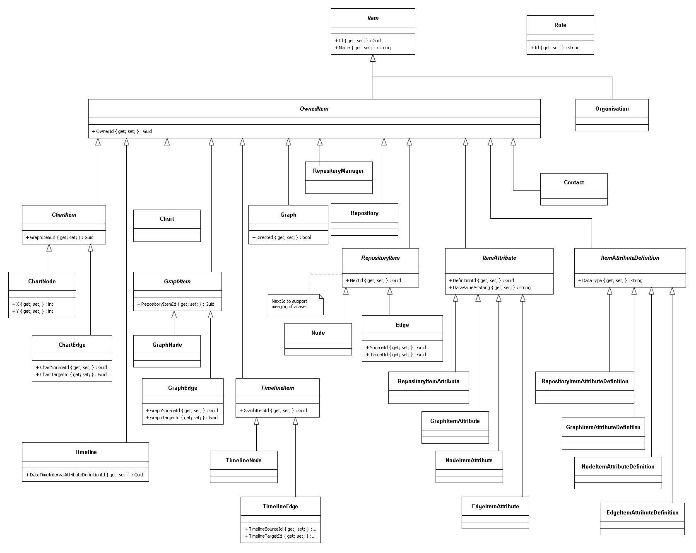

# GraphML 
GraphML analyses graphs for the following measures:

* <details>
    <summary>ranked shortest paths</summary>
These calculations help your users understand ways to travel through (or ‘traverse’) a network.<p/>
The distance function measures how many hops apart two nodes are in a network. Shortest path highlights the route that passes through the lowest number of nodes. 
Hops can also be weighted, meaning you can calculate actual distances, as well as the number of hops.
  </details>
* Social Network Analysis (SNA)
  * <details>
      <summary>closeness</summary>
This is the measure that helps you find the nodes that are closest to the other nodes in a network, based on their ability to reach them.<p/>
To calculate this, the algorithm finds the shortest path between each node, then assigns each node a score based on the sum of all the paths.<p/>
Nodes with a high closeness value have a lower distance to all other nodes. They’d be efficient broadcasters of information.
    </details>
  * <details>
      <summary>betweeness</summary>
Nodes with a high betweenness centrality score are the ones that most frequently act as ‘bridges’ between other nodes. 
They form the shortest pathways of communication within the network.<p/>
Usually this would indicate important gatekeepers of information between groups.
    </details>
  * <details>
      <summary>degree</summary>
The degree centrality measure finds nodes with the highest number of links to other nodes in the network.<p/>
Nodes with a high degree centrality have the best connections to those around them – they might be influential, or just strategically well-placed.
    </details>

## Prerequisites
<details>

1. Prerequisites:
  * host:
    * Linux
    * Windows (not tested but should work)
  * target:
    * Linux (services)
    * WebAssembly aka WASM (GUI)
  * .NET Core SDK v5.0
  * integrated development environment:
    * Visual Studio Code (Linux or Windows)
    * JetBrains Rider (Linux or Windows)
    * Visual Studio (Windows)
  * nodejs
  * git
  * Google Chrome web browser
  * database:
    * Microsoft SQL Server
    * MySQL or MariaDB
    * PostgreSQL
    * SQLite (local development only)
  * message queue:
    * [Apache ActiveMQ](http://activemq.apache.org/)
  * results store:
    * [Redis](https://redis.io/)
1. Optional
  * [Git Extensions](https://github.com/gitextensions/gitextensions) (Windows)
  * [Docker](https://docs.docker.com/docker-for-windows/install/) (Windows)
  * [SwitchStartupProject for VS 2019](https://heptapod.host/thirteen/switchstartupproject/) (Visual Studio)
  * [npm](https://www.npmjs.com/get-npm)
  * [Redis Commander](https://www.npmjs.com/package/redis-commander)
  * [DBeaver](https://dbeaver.io/)
  * [DB Browser for SQLite](https://sqlitebrowser.org/)
  * [SQLiteStudio](https://sqlitestudio.pl/)
  * Microsoft SQL Server Management Studio (Windows)
  * [ReportGenerator](https://github.com/danielpalme/ReportGenerator)
  * [python](https://www.python.org/downloads/windows/)

</details>

## Getting Started
<details>

1. clone repo
```bash
  git clone https://github.com/TrevorDArcyEvans/GraphML.git
```
1. build
```bash
  dotnet restore
  dotnet build
```
1. run tests
```bash
  dotnet test
```
1. run code coverage
```bash
  dotnet test /p:CollectCoverage=true /p:CoverletOutputFormat=opencover
```
1. generate code coverage report
``` bash
  reportgenerator -reports:**/coverage.opencover.xml -targetdir:./CodeCoverage
```
1. run API
```bash
  export ASPNETCORE_ENVIRONMENT=Development
  cd GraphML.API/bin/Debug/net5.0 
  ./GraphML.API
```
1. open [Swagger UI](http://localhost:5000/swagger/index.html)
1. start _Apache ActiveMQ_
1. start _Redis_
1. run analysis server
```bash
  export ASPNETCORE_ENVIRONMENT=Development
  cd GraphML.API/bin/Debug/net5.0 
  ./GraphML.Analysis.Server
```
1. open [_Apache ActiveMQ_ management console](http://localhost:8161/admin)
1. start _Redis Commander_
```bash
  redis-commander --port 8080
```
1. open [_Redis Commander_ management console](http://127.0.0.1:8080)

</details>

## Environment Variables
<details>

### Backend API
<details>

|Variable | Description | Example Value|
|---------|-------|--------------|
ASPNETCORE_ENVIRONMENT | ASP.NET Core runtime environment | `Production`, `Development`, `Test`
||
API_URI       | |
API_USERNAME  | |
API_PASSWORD  | |
||
DATASTORE_CONNECTION         | | SqLite
DATASTORE_CONNECTION_TYPE    | | SqLite
DATASTORE_CONNECTION_STRING  | | Data Source=&#124;DataDirectory&#124;Data/GraphML.sqlite3; |
||
LOG_CONNECTION_STRING | |
LOG_BEARER_AUTH       | | False
||
RESULT_DATASTORE | | localhost:6379
||
KESTREL_URL                  | | http://localhost:5000
||
MESSAGE_QUEUE_URL               | | activemq:tcp://localhost:61616
MESSAGE_QUEUE_NAME              | | GraphML
MESSAGE_QUEUE_POLL_INTERVAL_S   | | 5
MESSAGE_QUEUE_USE_THREADS       | | False

</details>
</details>

## Overview
<details><p/>

  

</details>

## Architecture
<details><p/>

  

</details>

## Analysis
<details><p/>

  

</details>

## Data Model
<details>
  <summary>Classes</summary>



</details>

<details>
  <summary>Composition</summary>


</details>

<details>
  <summary>Description</summary>

  * Item
    * Ultimate ancestor of all GraphML objects.
    * Models something which can be persisted.
    * Every item ultimately belongs to an Organisation
  * Organisation
    * Typically a company, organisation or other legal entity in which people work together.
      * police force
      * GCHQ
      * FBI
      * military
      * bank
    * Id and OrganisationId **must** be the same
  * Contact
    * A person identified by their email address.
    * The email address (Name) is used to link authentication (IdentityServer) to Role.
  * Role
    * The function performed by a Contact in the context of GraphML.
    * There are several, predefined functions in Roles
    * A Contact may have one or more Roles
  * Roles
    * User roles within GraphML
    * 
  * OwnedItem
    * Something which has an immediate owner, other than an Organisation
  * RepositoryManager
    * A means to group a subset of Repository in an Organisation in some logical manner.
    * For example, repositories could be grouped at a departmental level eg 'Financial Fraud' or 'Credit Control'
  * Repository
    * A complete collection of Node and Edge representing an area of interest.
  * GraphItem
    * Something which is in a Graph, either a GraphNode or a GraphEdge
  * Graph
    * A subset of Node and Edge from a Repository which have been extracted for separate analysis.
    * A Graph may be directed; in contract to a Repository, which has no notion of direction.
  * RepositoryItem
    * Something which is in a Repository, either a Node or an Edge
  * ItemAttribute
    * Additional data information attached to an Item
  * GraphNode
    * A Node which appears in a Graph.
    * Name may be different to that of underlying Node
  * GraphEdge
    * An Edge which appears in a Graph.
    * Name may be different to that of underlying Edge
  * Node
    * A vertex representing something of interest.
    * A Node may be connected to zero or one other Nodes by an Edge
    * A Node may have properties associated with it via an NodeItemAttribute
  * Edge
    * A link connecting two Node.
    * An Edge may have a 'weight/s' (or other properties) associated with it via an EdgeItemAttribute
    * An Edge is not directed 'per se'; this is set on the Graph
  * RepositoryItemAttribute
    * Additional data information attached to a Repository
  * GraphItemAttribute
    * Additional data information attached to a Graph
  * NodeItemAttribute
    * Additional data information attached to a Node
  * EdgeItemAttribute
    * Additional data information attached to an Edge

</details>

## Authentication & Authorisation
<details>

* enable `Development` mode by setting env var:  
```bash
  export ASPNETCORE_ENVIRONMENT=Development
```
* authentication (who you are) is handled by IdentityServer
* authorisation (what you can do) is handled by GraphML, based on an _email_ claim
* security is role based:
| Role        | Description |
|-------------|-------------|
| User        | An entity using GraphML |
| UserAdmin   | An entity managing a subset of data within GraphML, typically data belonging to a single organisation |
| Admin       | An entity managing all data within GraphML |
* SwaggerUI is only enabled in `Development` mode
* SwaggerUI authentication will redirect to a login screen in IdentityServer
* IdentityServer has some test users:
| UserName | Password     | Email                           | Roles |
|----------|--------------|---------------------------------|-------|
| `alice`  | `Pass123$`   | DrKool@KoolOrganisation.org     | Admin |
| `bob`    | `Pass123$`   | BobSmith@email.com              | none |
| `carol`  | `Pass123$`   | carol@KoolOrganisation.org      | UserAdmin |

</details>

## Multi-Tenancy
<details>

At this stage, multi-tenancy isolation is implemented in GraphML.Logic:
* GraphML.Logic.Validators
  * does the initial call even make sense
  * only allow calls on items which caller is allowed to access
* GraphML.Logic.Filters
  * only return items relevant to the caller
  * only return items caller is allowed to see

Future work will change to a database-per-client type of isolation
which is better suited to high security environments.
This will make validators and filters redundnant as all calls are
guaranteed to come from the same organisation.  In turn, this will
make the Organisation entity redundant.

</details>

## Misc
<details>

### Port Allocations
| Service | Port | Notes |
|---------|------|-------|
| IdentityServerAspnetIdentity | 44387 |
| GraphML.API | 5001 |
| GraphML.UI.Web | 5002 |
| Apache ActiveMQ | 61616 |
| Apache ActiveMQ console | 8161 |
| Redis | 6379 |
| Redis Commander | 8080 | default port 8081
| Microsoft SQL Server | 1443 |
| MariaDB | 3306 |
| PostgreSQL | 5432 |

### Apache ActiveMQ
You can monitor ActiveMQ using the Web Console by pointing your browser at http://localhost:8161/admin .  
From ActiveMQ 5.8 onwards the web apps is secured out of the box.  
The default username and password is `admin/admin`.

### Redis on Windows
Recommended method is to use a _Docker_ container:
```bash
  docker pull redis
  docker run -p 6379:6379 redis
```

### Redis Commander
```bash
  npm install -g redis-commander
  redis-commander --port 8080
```
open [_Redis Commander_ management console](http://127.0.0.1:8080)

</details>
